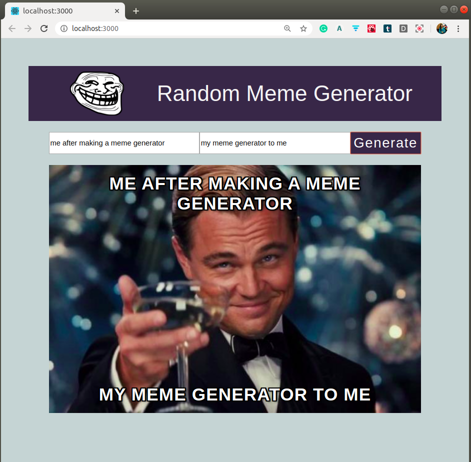

# Random-meme-generator
A customised meme generator app built in ReactJS. It is a web app fetching data from an API with random meme images and have the option of adding a top text and a bottom text to it.

# Screenshot of the App

